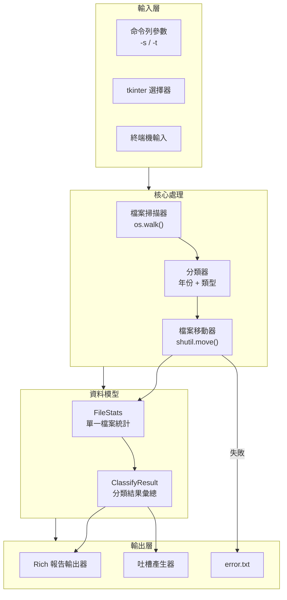

# File Organizer

[](https://opensource.org/licenses/MIT)
[](https://www.python.org/)
[](https://github.com/Textualize/rich)
[](https://github.com/astral-sh/uv)

[← 回到 Muripo HQ](https://tznthou.github.io/muripo-hq/)

依照年份與類型自動分類檔案的命令列工具，附帶統計報告與「大檔案羞辱榜」。使用 **Rich** 打造精美的終端機輸出介面。

---

## 功能特色

- **自動分類**：依照檔案修改年份 → 檔案類型建立資料夾結構
- **統計報告**：摘要面板、年份分佈長條圖、類型分佈表格
- **羞辱榜**：列出 Top 5 大檔案，配上毒舌吐槽評語
- **CLI 支援**：可用命令列參數指定來源與目標路徑
- **GUI 支援**：支援 tkinter 資料夾選擇器（如果可用）
- **自動降級**：tkinter 不可用時自動切換為終端機輸入模式
- **同名處理**：自動加上時間戳避免檔案覆蓋
- **錯誤記錄**：失敗的檔案會記錄到 error.txt

---

## 系統架構



---

## 技術棧

| 技術 | 版本 | 用途 |
|------|------|------|
| Python | 3.11+ | 主程式語言 |
| Rich | 14.x | 終端機美化輸出 |
| UV | 0.9+ | 套件與專案管理 |
| tkinter | - | GUI 資料夾選擇（選用） |

---

## 快速開始

### 安裝

```bash
cd day-11-file-organizer
uv sync
```

### 使用方式

#### 命令列模式（推薦）

```bash
# 指定來源與目標資料夾
uv run file-organizer -s ~/Downloads -t ~/Organized

# 簡寫形式
uv run file-organizer -s ./messy -t ./clean
```

#### 互動模式

```bash
uv run file-organizer
```

如果 tkinter 可用，會跳出資料夾選擇視窗；否則會提示輸入路徑。

### 參數說明

| 參數 | 說明 |
|------|------|
| `-s`, `--source` | 來源資料夾路徑 |
| `-t`, `--target` | 目標資料夾路徑 |
| `--no-gui` | 強制使用終端機輸入模式 |
| `--clean` | 處理完成後清理來源資料夾中的空資料夾 |
| `-h`, `--help` | 顯示說明 |

---

## 輸出結構

年份資料夾會依照檔案的**修改時間**自動建立：

```
target/
├── 2025/                      # 今年修改的檔案
│   ├── doc/
│   │   └── report.docx
│   ├── xls/
│   │   └── data.xlsx
│   └── ppt/
│       └── presentation.pptx
├── 2023/                      # 2023 年修改的檔案
│   └── ...
├── 2019/                      # 更早的檔案
│   └── ...
└── error.txt                  # 處理失敗的記錄
```

---

## 支援的檔案類型

| 副檔名 | 分類資料夾 |
|--------|-----------|
| .doc, .docx | doc |
| .xls, .xlsx | xls |
| .ppt, .pptx | ppt |
| .pdf | pdf |
| .jpg, .jpeg, .png, .gif | 依副檔名 |
| .mp3, .mp4, .mov | 依副檔名 |
| .zip, .rar, .7z | 依副檔名 |
| 其他 | 依副檔名 |

---

## 羞辱榜吐槽範例

| 觸發條件 | 吐槽語句 |
|----------|----------|
| 檔名含「備份」 | 備份狂魔！你是不是覺得硬碟空間不要錢？ |
| 檔名含「最終版」 | 又一個『最終版』，我看這輩子都最終不了 |
| 檔案超過 5 年 | 這檔案都可以上幼稒園了，還不送走？ |
| 檔案超過 10 年 | 考古學家來電！這化石級檔案該進博物館了 |
| 大小超過 100MB | 這麼肥是要撐爆硬碟嗎？數位減肥了解一下 |
| 大小超過 500MB | 半個 G！你是把整個專案打包進去了？ |
| PPT 類型 | PPT 戰士！會議的噩夢製造機 |
| 檔名含 temp/test | 『暫時』的東西活得比你的新年目標還久 |

---

## 專案結構

```
day-11-file-organizer/
├── pyproject.toml              # UV 專案設定
├── .python-version             # Python 版本指定
├── README.md                   # 專案說明
├── uv.lock                     # 依賴鎖定檔
└── src/
    └── day_11_file_organizer/
        ├── __init__.py         # 套件入口
        ├── main.py             # 主程式與 CLI
        ├── models.py           # 資料模型
        ├── reporter.py         # Rich 報告輸出
        └── roast.py            # 吐槽產生器
```

---

## 隨想

### 數位囤積症

整理檔案時，總會發現一些「捨不得刪」的東西：

- 2015 年的安裝檔，早就不知道是什麼軟體
- 「備份_備份_最終版_v3」，連自己都忘了哪個才是真的
- 「暫時存放」的資料夾，暫時了五年

這個工具的「羞辱榜」功能，其實是一種溫柔的提醒：

> 數位空間不是無限的，你的注意力更不是。

當然，要不要刪除，最終還是你自己決定。這個工具只負責整理和吐槽。

### 為什麼用毒舌？

因為正經的提醒沒人理。

---

## 授權

本專案採用 [MIT License](LICENSE) 授權。
