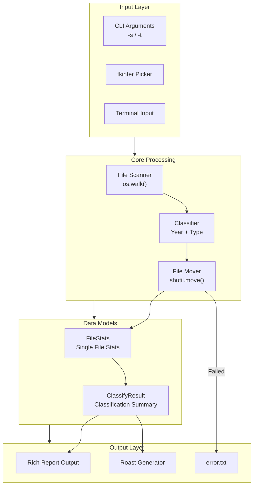

# File Organizer - Statistics Report & Large File Shame List

[](https://opensource.org/licenses/MIT)
[](https://www.python.org/)
[](https://github.com/Textualize/rich)
[](https://github.com/astral-sh/uv)

[← Back to Muripo HQ](https://tznthou.github.io/muripo-hq/) | [中文](README.md)

A command-line tool that automatically organizes files by year and type, featuring statistics reports and a "Large File Shame List". Built with **Rich** for beautiful terminal output.

---

## Features

- **Auto-classification**: Creates folder structure based on file modification year and file type
- **Statistics Report**: Summary panel, year distribution bar chart, type distribution table
- **Shame List**: Lists Top 5 largest files with sarcastic roast comments
- **CLI Support**: Specify source and target paths via command-line arguments
- **GUI Support**: tkinter folder picker (if available)
- **Auto Fallback**: Automatically switches to terminal input mode when tkinter is unavailable
- **Duplicate Handling**: Automatically adds timestamp to avoid file overwriting
- **Error Logging**: Failed files are logged to error.txt

---

## System Architecture



---

## Tech Stack

| Technology | Version | Purpose |
|------------|---------|---------|
| Python | 3.11+ | Main programming language |
| Rich | 14.x | Terminal beautification |
| UV | 0.9+ | Package & project management |
| tkinter | - | GUI folder picker (optional) |

---

## Quick Start

### Installation

```bash
cd day-11-file-organizer
uv sync
```

### Usage

#### Command Line Mode (Recommended)

```bash
# Specify source and target folders
uv run file-organizer -s ~/Downloads -t ~/Organized

# Short form
uv run file-organizer -s ./messy -t ./clean
```

#### Interactive Mode

```bash
uv run file-organizer
```

If tkinter is available, a folder picker window will appear; otherwise, it will prompt for path input.

### Parameters

| Parameter | Description |
|-----------|-------------|
| `-s`, `--source` | Source folder path |
| `-t`, `--target` | Target folder path |
| `--no-gui` | Force terminal input mode |
| `--clean` | Clean up empty folders in source after processing |
| `-h`, `--help` | Show help |

---

## Output Structure

Year folders are automatically created based on file **modification time**:

```
target/
├── 2025/                      # Files modified this year
│   ├── doc/
│   │   └── report.docx
│   ├── xls/
│   │   └── data.xlsx
│   └── ppt/
│       └── presentation.pptx
├── 2023/                      # Files modified in 2023
│   └── ...
├── 2019/                      # Older files
│   └── ...
└── error.txt                  # Failed processing log
```

---

## Supported File Types

| Extension | Classification Folder |
|-----------|----------------------|
| .doc, .docx | doc |
| .xls, .xlsx | xls |
| .ppt, .pptx | ppt |
| .pdf | pdf |
| .jpg, .jpeg, .png, .gif | by extension |
| .mp3, .mp4, .mov | by extension |
| .zip, .rar, .7z | by extension |
| Others | by extension |

---

## Shame List Roast Examples

| Trigger Condition | Roast Comment |
|-------------------|---------------|
| Filename contains "backup" | Backup maniac! Do you think disk space is free? |
| Filename contains "final" | Another 'final version', I bet it'll never be final |
| File over 5 years old | This file could go to kindergarten, time to let it go? |
| File over 10 years old | Archaeologist calling! This fossil belongs in a museum |
| Size over 100MB | This chunky file is going to burst your hard drive. Time for a digital diet! |
| Size over 500MB | Half a gig! Did you pack an entire project in there? |
| PPT type | PPT warrior! The nightmare factory of meetings |
| Filename contains temp/test | 'Temporary' stuff living longer than your New Year's resolutions |

---

## Project Structure

```
day-11-file-organizer/
├── pyproject.toml              # UV project config
├── .python-version             # Python version specification
├── README.md                   # Project documentation
├── uv.lock                     # Dependency lock file
└── src/
    └── day_11_file_organizer/
        ├── __init__.py         # Package entry
        ├── main.py             # Main program & CLI
        ├── models.py           # Data models
        ├── reporter.py         # Rich report output
        └── roast.py            # Roast generator
```

---

## Reflections

### Digital Hoarding Syndrome

When organizing files, you always find things "too precious to delete":

- Installation files from 2015, no idea what software it was
- "backup_backup_final_v3", can't remember which one is the real deal
- A "temporary storage" folder that's been "temporary" for five years

The "Shame List" feature is actually a gentle reminder:

> Digital space isn't infinite, and neither is your attention.

Of course, whether to delete is ultimately your decision. This tool only organizes and roasts.

### Why the Sarcasm?

Because nobody listens to polite reminders.

---

## License

This project is licensed under the [MIT License](LICENSE).

---

## Author

Tzu-Chao - [tznthou@gmail.com](mailto:tznthou@gmail.com)
